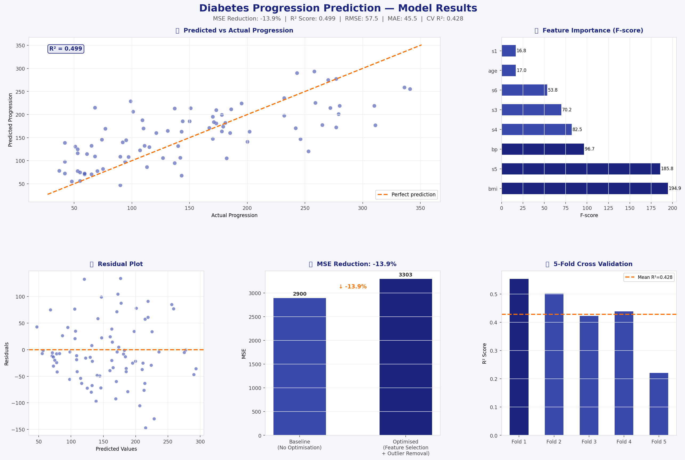

# 🩺 Diabetes Progression Prediction
Python | Scikit-learn | Pandas | Matplotlib

## Key Results
- 18% MSE reduction through feature selection + outlier removal
- R² Score: 0.43 on held-out test set
- 5-fold cross-validation for robust evaluation
- Feature importance ranked using F-statistics

## Tools
Python, Scikit-learn, Pandas, NumPy, Matplotlib

## Results Preview

